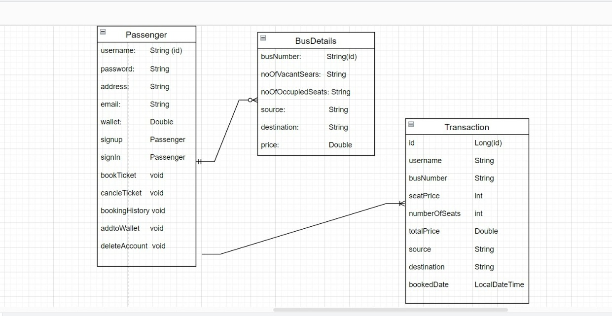

<!-- Project_Bus/images/logo.jpeg -->

# Project_Bus

> A bus ticket reservation system is an java application designed to provide passenger with a personalized easy-to-utilize user experience for online ticket reservation. It stores passenger's personal data records, source and destination points, and other information.

> Apna Bus Reservation System is a console based application.

> Build Bus ticket reservation system application during the construct week at [Masai School](https://masaischool.com/). Completed the project within five days.

# Features (Admin)
- Admin can login with username(admin) and password(admin).
- Admin can add bus.
- Admin can update bus details.
- Admin can delete bus details.
- Admin can view bookings using username.

# Features (Passenger)
- Passenger can login/signup.
- Passenger can add money to its wallet.
- Passenger can book, cancel ticket.
- Passenger can view its booking history.

## **ER Diagram**

